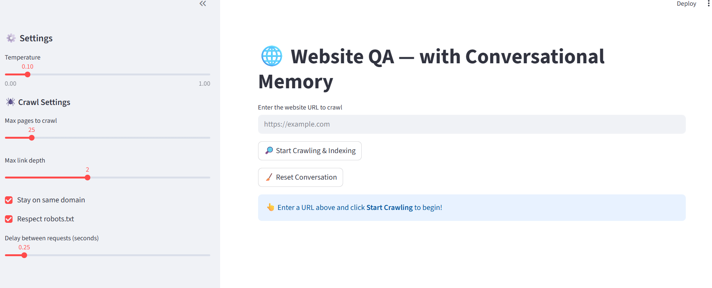

---

# 🌐 Website QA RAG — with Conversational Memory (Ollama + FAISS)



Crawl a website, index its content, and chat with it using **Retrieval-Augmented Generation (RAG)**.
Built with **Streamlit**, **LangChain**, **HuggingFace Embeddings**, **FAISS**, and **Ollama** (local LLM).
Supports **conversational memory**, **robots.txt** awareness, **same-domain** restriction, and **source citations**.


---

## ✨ Features

* **Website Crawler (BFS):** starts from a URL, follows links (configurable depth + page cap)
* **Polite Crawling:** optional **robots.txt** respect and request delay
* **Domain Controls:** stay on originating domain or explore external links
* **Robust Text Extraction:** cleans HTML via BeautifulSoup + lxml
* **Chunking & Vector Search:** `RecursiveCharacterTextSplitter` + **FAISS**
* **Embeddings:** `sentence-transformers/all-MiniLM-L6-v2`
* **Local LLM via Ollama:** default `qwen2.5:1.5b` (configurable)
* **Conversational Memory:** keeps chat history per session
* **Source Attribution:** shows URLs for retrieved context
* **Caching:** requests + embeddings/LLM objects cached for speed

---

## 🧱 Architecture (High Level)

```
          ┌─────────────┐
          │   Streamlit │  UI (sidebar controls, chat)
          └─────┬───────┘
                │
        Crawl website (BFS)
                │         robots.txt / delay
      ┌─────────▼──────────┐
      │  HTML Fetch + Parse │ → clean text + title
      └─────────┬──────────┘
                │
       Chunk + Embed (MiniLM)
                │
       ┌────────▼─────────┐
       │    FAISS Index   │ ← k=4 similarity
       └────────┬─────────┘
                │  (docs → prompt context)
        ┌───────▼─────────┐
        │    ChatOllama    │  qwen2.5:1.5b @ http://127.0.0.1:11434
        └────────┬─────────┘
                 │  memory (RunnableWithMessageHistory)
            ┌────▼────┐
            │  Answer │ + sources
            └─────────┘
```

---

## 🛠️ Requirements

```bash
pip install \
  streamlit langchain langchain-community langchain-text-splitters \
  faiss-cpu sentence-transformers beautifulsoup4 lxml requests
```

You’ll also need **Ollama** running locally:

* Install: [https://ollama.com](https://ollama.com)
* Start Ollama service, then pull the default model:

  ```bash
  ollama pull qwen2.5:1.5b
  ```

---

## 🚀 Quickstart

1. **Clone** this repo and ensure **Python 3.10+** is available.
2. **Install deps** (see Requirements).
3. **Run the app**:

   ```bash
   streamlit run app.py
   ```
4. In the app:

   * Enter a **starting URL** (e.g., `https://example.com`)
   * Adjust **Crawl Settings** in the sidebar:

     * *Max pages*, *Max link depth*
     * *Stay on same domain*
     * *Respect robots.txt*
     * *Delay between requests*
   * Click **Start Crawling & Indexing**
   * Once indexed, ask questions in **💬 Ask Questions**

---

## ⚙️ Default Configuration

These defaults are set near the top of `app.py`:

```python
DEFAULT_USER_AGENT = "Mozilla/5.0 (compatible; WebsiteQA-RAG/1.0)"
OLLAMA_BASE_URL    = "http://127.0.0.1:11434"
DEFAULT_MODEL      = "qwen2.5:1.5b"

CHUNK_SIZE         = 1000
CHUNK_OVERLAP      = 100
RETRIEVAL_K        = 4
```

You can also adjust runtime parameters from the **sidebar**:

* Temperature (LLM)
* Max pages, link depth
* Same-domain only
* Respect robots.txt
* Request delay (seconds)

---

## 🧠 How It Works (RAG + Memory)

1. **Crawl & Clean:** Fetch HTML, strip scripts/styles, normalize whitespace, extract page title.
2. **Split:** Chunk text with overlap for better semantic retrieval.
3. **Embed & Index:** Create embeddings (MiniLM) and store in **FAISS**.
4. **Retrieve:** On each question, retrieve top-K chunks.
5. **Generate:** Compose a prompt (system + context + question) and call **Ollama**.
6. **Remember:** Maintain chat history via `RunnableWithMessageHistory`.

**Note:** The assistant is instructed to answer **only** from retrieved context and to say “I don’t know” if insufficient.

---

## 🧭 Usage Tips

* If you get **no content**, lower *Max link depth* first (depth-first explosions), then increase *Max pages* gradually.
* For large sites, keep *same domain only* **on** to prevent drifting to CDNs or external blogs.
* Use a small **request delay** (e.g., 0.25s) to be polite and avoid rate-limits.
* The **Sources** section under answers shows which pages informed the response.

---

## 🧪 Example Session

1. Start at `https://docs.streamlit.io/`
2. Crawl with:

   * Max pages: 25
   * Max depth: 2
   * Same domain: ✅
   * Respect robots.txt: ✅
3. Ask:

   * “How do I cache expensive functions?”
   * “What’s the best way to lay out columns?”
   * “Provide a quick example for file upload.”

You should see brief answers with **clickable sources**.

---

## 🧰 Troubleshooting

**Ollama connection errors**

* Ensure the service is running:

  ```bash
  ollama serve
  ```
* Verify the URL: `http://127.0.0.1:11434`
* Pull the model:

  ```bash
  ollama pull qwen2.5:1.5b
  ```

**`lxml` install issues (Windows)**

* Try:

  ```bash
  pip install --upgrade pip wheel setuptools
  pip install lxml
  ```
* Or use prebuilt wheels (Python 3.10+ recommended).

**No results / poor answers**

* Increase *Max pages* to broaden coverage.
* Increase *Max depth* to follow deeper links.
* Reduce *Temperature* for more deterministic outputs.
* Verify the site allows crawling and serves **text/html** (not PDFs/images).

**Cached data feels stale**

* Use Streamlit’s **Rerun** or clear cache:

  * In the app: “⋮” → “Clear cache”
  * Or programmatically adjust cache TTLs.

---

## 📈 Performance Notes

* MiniLM is fast and compact; for higher quality, you can switch to a larger embedding model (with a speed tradeoff).
* FAISS on CPU is fine for thousands of chunks; for very large sites, consider sharding or persistent storage.
* Limit *Max pages* and *Max depth* to control crawl size and memory usage.

---

## 🔒 Respect & Compliance

* **robots.txt:** When enabled, the crawler will avoid disallowed paths.
* Always comply with the site’s **Terms of Service**.
* Consider adding rate limiting and user-agent identification for production.

---

## 🧩 Extending the App

* **Persistence:** Save/load FAISS index to disk.
* **Model Selector:** Surface model list from Ollama (e.g., `llama3`, `mistral`, etc.).
* **Rerankers:** Add cross-encoders to rerank retrieved chunks.
* **Filters:** Add URL allow/deny regex filters.
* **PDF Support:** Detect and parse PDFs with `pypdf` (if content isn’t HTML).
* **Auth Headers:** Support cookies or headers for gated docs (within TOS).

---

## 🗂️ Project Structure (suggested)

```
.
├─ app.py                     # Streamlit app (UI + pipeline)
├─ requirements.txt           # Python dependencies (optional)
├─ README.md                  # This file
└─ data/                      # (optional) saved indices / exports
```

---

## 🧪 Minimal Code Snippet (Embed + FAISS)

```python
from langchain_community.embeddings import HuggingFaceEmbeddings
from langchain_community.vectorstores import FAISS

emb = HuggingFaceEmbeddings(model_name="sentence-transformers/all-MiniLM-L6-v2")
vs  = FAISS.from_texts(["doc one", "doc two"], emb)
docs = vs.similarity_search("query", k=4)
```

---

## 🖥️ Deployment

* **Local:** `streamlit run app.py`

* **Docker (example)**

  ```dockerfile
  FROM python:3.11-slim
  WORKDIR /app
  COPY . .
  RUN pip install --no-cache-dir -r requirements.txt
  EXPOSE 8501
  CMD ["streamlit", "run", "app.py", "--server.address=0.0.0.0"]
  ```

  Then:

  ```bash
  docker build -t website-qa-rag .
  docker run -p 8501:8501 --add-host=host.docker.internal:host-gateway website-qa-rag
  ```

  > Ensure the container can reach your host’s Ollama (`host.docker.internal:11434` on macOS/Windows; map accordingly on Linux).
  
---

## ❓ FAQ

**Can I use a different LLM?**
Yes—change `DEFAULT_MODEL` and pull it via Ollama (`ollama pull <model>`). Update temperature in the sidebar.

**Why only HTML?**
This version filters on `text/html`. You can extend it to parse PDFs or JSON if needed.

**Where’s the memory kept?**
In-session via `ChatMessageHistory` (`RunnableWithMessageHistory`). It clears on **Reset Conversation** or app restart.

---

## 📜 License

**MIT** — see `LICENSE` for details.

---

## 🙌 Acknowledgements

* [Streamlit](https://streamlit.io/)
* [LangChain](https://python.langchain.com/)
* [FAISS](https://github.com/facebookresearch/faiss)
* [Ollama](https://ollama.com/)
* [Sentence-Transformers](https://www.sbert.net/)

---
